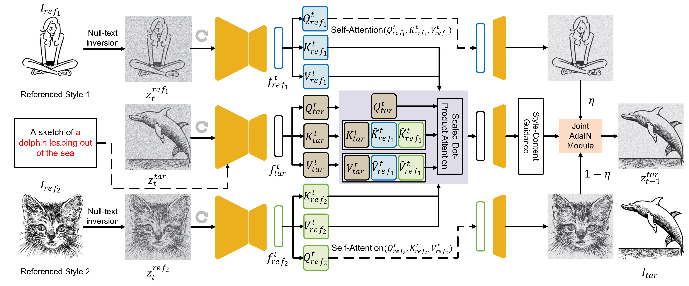
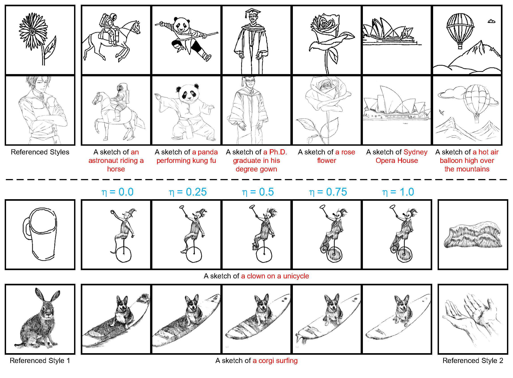
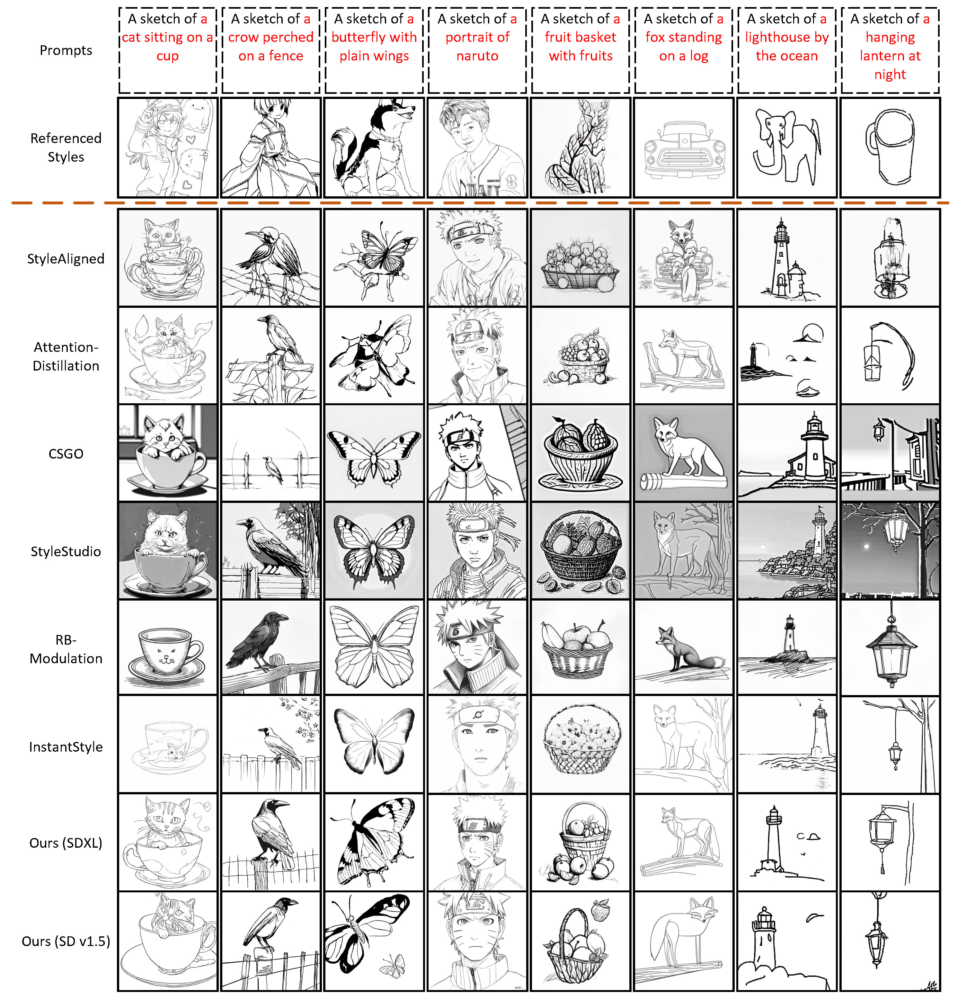
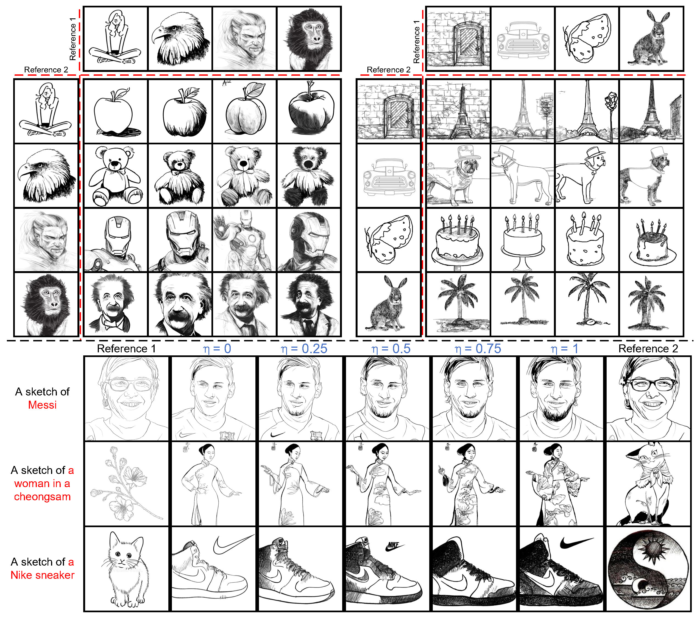

<div align="center">
<h1>Text to Sketch Generation with Multi-Styles</h1>
  
**Tengjie Li**<sup>1</sup> · **Shikui Tu**<sup>1✉</sup> · **Lei Xu**<sup>12✉</sup>

<sup>1</sup>School of Computer Science, Shanghai Jiao Tong University

<sup>2</sup>Guangdong Laboratory of Artificial Intelligence and Digital Economy (SZ), Guangdong, China

<sup>✉</sup>corresponding authors

<a href='https://arxiv.org/abs/2511.04123'></a>
<a href='https://openreview.net/pdf?id=C7Ed8V44JY'></a>

</div>

## Introduction 📖
This repo is the official PyTorch implementation of our NeurIPS 2025 paper [Text to Sketch Generation with Multi-Styles](https://openreview.net/pdf?id=C7Ed8V44JY). The proposed M3S is a training-free framework for generating sketches with multi styles with reference styles. If you find any bugs or have suggestions, welcome to raise issues.

## Pipeline 	💻
<p align="center">
  
</p>

## Capabilities 🚅 
 🔥 Our M3S achieves **text to sigle-style sketch generation, text to multi-style sketch generation, style preference controllability**.🔥 
 <p align="center">
  
</p>

## Getting Started 🏁
### 1. Clone the code and prepare the environment
```bash
git clone https://github.com/CMACH508/M3S.git
cd M3S

# create env using conda
conda env create -f environment.yml
conda activate M3S
```

```python
# some addtional requirements 
python
import nltk
nltk.download('punkt')
nltk.download('averaged_perceptron_tagger')
```
Change the pretrained stable diffusion model path if you need:
```bash
cd SDv1.5 (or SDXL)
vim utils/model_utils.py
```

### 2. Inference 🚀
To generate sketches:
```bash
# You can change the parameters in test.sh for different styles, contents, and style tendencies.
# The role of each parameter is explained in test.sh.
cd SDv1.5 (or SDXL)
bash test.sh
```

```bash
# To reproduce the single-style qualitative results:
cd SDv1.5 (or SDXL)
python -u Generation_demo.py
```

### 3. Evaluation
```bash
#To evaluate the results:
cd SDv1.5 (or SDXL)
cd notebooks
run the jupyter notebook metrics_test.ipynb
```

## Demos
<p align="center">
  <br>
  🔥 For more results, visit the Appendix of our paper. 🔥
</p>

### Single Style
<p align="center">
  
</p>

### Multi Styles
<p align="center">
  
</p>

## Acknowledgements
Our code is based on [Cross-Image Attention](https://github.com/garibida/cross-image-attention)

## Citation 💖
If you find M3S useful for your research, welcome to 🌟 this repo and cite our work using the following BibTeX:

```bibtex
@inproceedings{
li2025text,
title={Text to Sketch Generation with Multi-Styles},
author={Tengjie Li and Shikui Tu and Lei Xu},
booktitle={The Thirty-ninth Annual Conference on Neural Information Processing Systems},
year={2025},
url={https://openreview.net/forum?id=C7Ed8V44JY}
}
```
